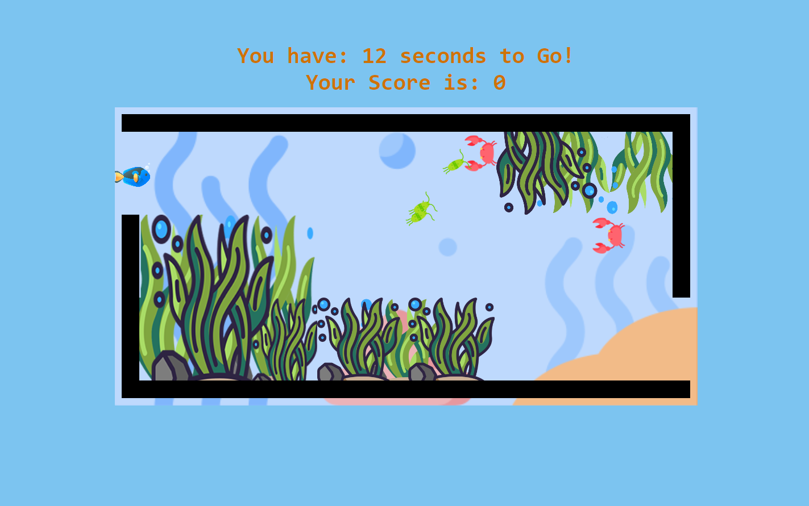
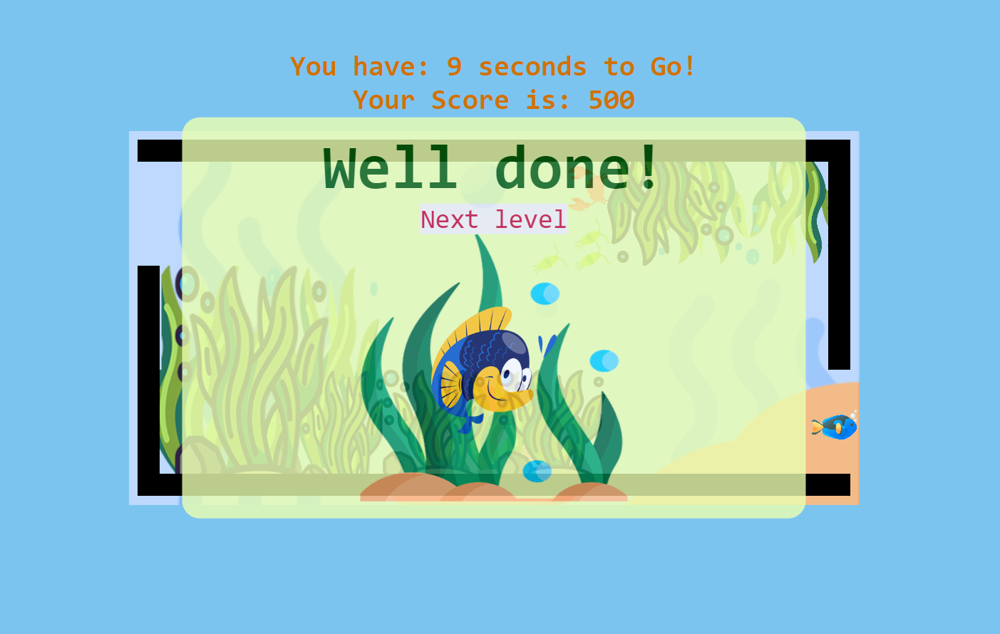
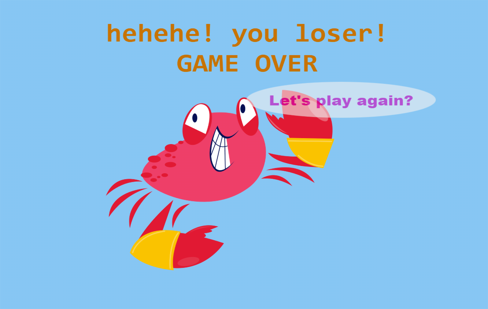

# Sam's Little Fish

## Description

Sam's little fish is trying to scape and save himself from the crabs' trap.  
**An OOP game built with web technologies (html, css, javascript) and DOM manipulation.**  
 

## How to play  

- Move Sam's fish with arrow keys  

- Shoot bubbles with space key to kill the crabs  

- Collect/eat the planktons  

- And leave before time's up!  
 

## DEMO
Find the live game [here](https://mog-rouhi.github.io/project-1-oop-game/)

 

## Further Improvements
 

- Implement customizable difficulty options. 
- Build further levels.
 

   

 

    

